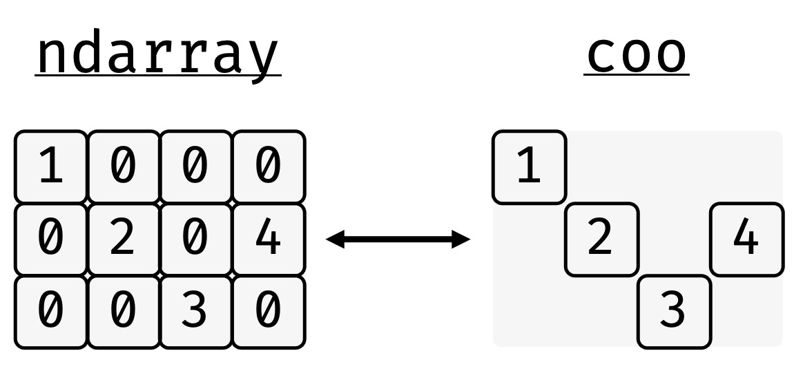

Sparse Matrices
===============

A sparse matrix is a matrix, which contains mostly zeros. Rather than
storing the zeros explicitly, only the non-zero values are stored
together with information that allows one to reconstruct the equivalent
dense matrix.

>>> import bsparse.sparse as sp
>>> import numpy as np
>>> arr = np.array(
...     [
...         [1, 0, 0, 0],
...         [0, 2, 0, 4],
...         [0, 0, 3, 0],
...     ]
... )

The equivalent dense matrix can be stored in different equivalent ways.
In bsparse the coordinate (COO), compressed sparse row (CSR), and the
diagonal (DIA) storage schemes are implemented.

.. figure:: figures/formats.jpg
    :scale: 25%

bsparse facilitates the conversion between these storage formats as well
as their creation from ``sparrays`` or ``ndarrays``.

>>> coo = sp.COO.from_array(arr)
>>> coo
COO(shape=(3, 4), nnz=4, dtype=int64)
>>> coo.tocsr()
CSR(shape=(3, 4), nnz=4, dtype=int64)
>>> coo.todia()
DIA(shape=(3, 4), nnz=8, dtype=int64)

All sparse matrices have a datatype of the underlying scalars
(``.dtype``), a 2D matrix shape (``.shape``), a number of explicitly
stored values (``.nnz``), and a symmetry attribute (``.symmetry``).

>>> coo.dtype
dtype('int64')
>>> coo.shape
(3, 4)
>>> coo.nnz
5
>>> coo.symmetry  # None

The matrix can be sliced and elements can be set and accessed using
NumPy-style indexing.

>>> coo[1, 1]
2
>>> coo[2, 3] = 5
>>> coo[2, 3]
5
>>> coo[:2, 1::2]
COO(shape=(2, 2), nnz=2, dtype=int64)
>>> coo[:2,1::2].toarray()
array([[0, 0], [2, 4]])

Sparse matrices also support mathematical operations, which -- depending
on the storage scheme -- can differ in efficiency. Here an overview to
give you a very rough rule of thumb (**DYOB -- do your own 
benchmarking!**)

.. figure:: figures/overview.jpg
    :scale: 25%
